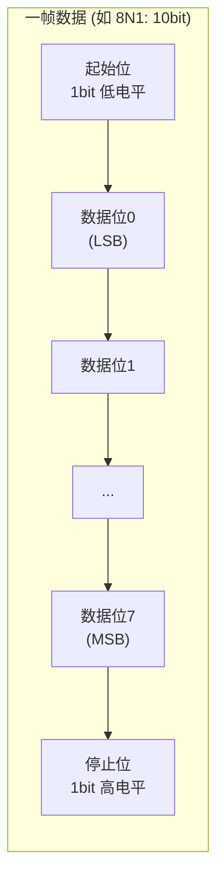
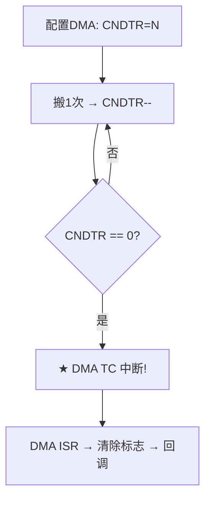
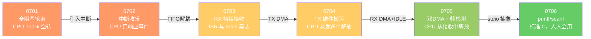

## 前言

最近系统地学习了 STM32F103 的 UART 串口通信，从最简单的阻塞轮询开始，逐步演进到中断模式、FIFO 解耦、DMA 搬运、IDLE 帧检测，最后实现 printf/scanf 重定向。整个过程横跨六个工程，层层递进，涵盖了嵌入式 UART 开发中几乎所有核心概念。

本文将这六个工程的演进逻辑、关键概念和代码实现整理成文，既是对学习过程的总结，也希望对同样在学习 STM32 的朋友有所启发。

硬件平台：STM32F103C8T6（Cortex-M3，64KB Flash，20KB SRAM），USART1（PA9=TX，PA10=RX），波特率 115200，8 数据位，1 停止位，无校验（8N1）。

---

## 一、串口通信基础

### 1.1 同步传输与异步传输

在电子通信中，数据传输分为**同步**和**异步**两种方式，核心区别在于：有没有一种方法实现"约好时间"。

**同步传输**需要两根信号线：

- **时钟信号**：通知对方何时读取数据
- **数据信号**：承载实际数据

其优点是速率可变（提高时钟频率即可），抗干扰能力强；缺点是信号线多。

**异步传输**只需要数据信号线：

- 发送方通过**起始位**通知接收方"开始传输"
- 双方**提前约定**数据表示方式和速率
- 接收方在起始位后等待 1.5 位时间，在数据位的**中心点**采样

数据信号线少，但速率需双方提前约定，抗干扰能力较弱。

### 1.2 UART 协议

UART（Universal Asynchronous Receiver Transmitter，通用异步收发器）是最常用的串行通信协议。它以**全双工**方式工作，最简连线仅需三根：TxD（发送）、RxD（接收）、GND（共地参考）。

**数据帧格式**如下：



每一帧由以下部分组成：

1. **起始位**：数据线从空闲（高电平）拉低，持续 1 位时间，通知接收方"开始传输"
2. **数据位**：5~8 位可配，**先发最低位（LSB）**
3. **校验位**（可选）：奇校验或偶校验
4. **停止位**：数据线恢复高电平，1 / 1.5 / 2 位长度

**数据传输流程**：

1. 平时数据线处于**空闲**状态（高电平）
2. 发送时，UART 将 TxD 拉低并维持 1 位时间——这就是起始位
3. 接收方检测到起始位后，等待 **1.5 位时间**（半位偏移，目的是对准数据位的中心点），然后逐位采样
4. 数据位从最低位开始逐位发送
5. 如有校验位，紧随数据位之后
6. 最后发送停止位，数据线恢复空闲


**等待 1.5 位时间的本质**：不是"等数据来"，而是**半位偏移采样**——在数据位的中心点采样，获得最稳定的读取结果。


### 1.3 波特率与比特率

波特率（Baud Rate）与比特率（Bit Rate）经常被混淆，但它们是不同的概念：

- **波特率**：1 秒内传输的**信号状态数**（波形变化次数）
- **比特率**：1 秒内传输的**数据 bit 数**

**关系式**：`比特率 = 波特率 × 每个波形承载的 bit 数`

在简单的两电平 UART 中（仅 0/1 两种电平），一个波形只表示 1 bit，此时 **波特率 = 比特率**。如果有 4 种电平（如 0V/1.1V/2.2V/3.3V 分别表示 00/01/10/11），则一个波形承载 2 bit，比特率 = 波特率 × 2。

举例说明：

```c
// 两电平（1 波形 = 1 bit）
// 传输 0x78 (0b01111000)，先发 LSB：
// 第1ms: 设置 0V，      接收方识别为 bit0=0
// 第2ms: 设置 0V，      接收方识别为 bit1=0
// 第3ms: 设置 0V，      接收方识别为 bit2=0
// 第4ms: 设置 3.3V，    接收方识别为 bit3=1
// ...
// 第8ms: 设置 0V，      接收方识别为 bit7=0
// 需 8ms，传 8 个状态 = 8bit → 波特率 = 比特率

// 四电平（1 波形 = 2 bit）
// ① 第1ms: 0V      → bit0=0, bit1=0
// ② 第2ms: 1.6V    → bit2=0, bit3=1
// ③ 第3ms: 2.4V    → bit4=1, bit5=1
// ④ 第4ms: 0.8V    → bit6=1, bit7=0
// 需 4ms，传 4 个状态 = 8bit → 波特率 × 2 = 比特率
```

STM32F1 的 UART 采用 **16 倍过采样**，波特率由以下公式计算：

```c
// USARTDIV = PCLK / (16 × BaudRate)
// PCLK2 = 8MHz, BaudRate = 115200
// DIV = 8,000,000 / (16 × 115,200) = 4.340
// 实际波特率 ≈ 115,207，误差 ~0.006%
```

### 1.4 UART 的电平标准

UART 使用 TTL/CMOS 逻辑电平：

| 电平 | TTL | CMOS (3.3V) |
|------|-----|-------------|
| 逻辑 0 | 0~0.8V | 0~0.8V |
| 逻辑 1 | 2.0~5.0V | 2.0~3.3V |

长距离传输时通常转换为 RS-232 电平（+3~+12V 表示逻辑 0，-3~-12V 表示逻辑 1），以增强抗干扰能力。

---

## 二、STM32 UART 的三种编程方式

STM32 的 UART 外设配合 HAL 库，提供三种编程方式，对应不同的效率和使用场景。UART 的核心数据流是：CPU 将并行数据写入 UART 的 TDR 寄存器 → UART 按格式串行发到 TxD 引脚；RxD 引脚收到串行数据 → UART 收集到 RDR 寄存器 → CPU 读取。

### 2.1 查询方式（Polling）

**原理**：CPU 主动轮询 UART 状态寄存器（SR），判断数据是否就绪。



#### HAL_UART_Transmit（阻塞发送）

```c
HAL_StatusTypeDef HAL_UART_Transmit(UART_HandleTypeDef *huart,
                                     const uint8_t *pData,
                                     uint16_t Size,
                                     uint32_t Timeout);
```

| 参数 | 类型 | 方向 | 说明 |
|------|------|------|------|
| `huart` | `UART_HandleTypeDef*` | 输入 | UART 外设句柄指针，包含 USART 实例和配置信息 |
| `pData` | `const uint8_t*` | 输入 | 待发送数据的缓冲区指针，声明为 `const`（只读） |
| `Size` | `uint16_t` | 输入 | 要发送的字节数 |
| `Timeout` | `uint32_t` | 输入 | 超时时间（毫秒），设为 `HAL_MAX_DELAY` 表示无限等待 |

**返回值** `HAL_StatusTypeDef` 枚举：

| 值 | 含义 |
|----|------|
| `HAL_OK` | 发送成功 |
| `HAL_TIMEOUT` | 超时（在 Timeout 时间内未完成发送） |
| `HAL_BUSY` | 外设忙（上次传输尚未结束） |
| `HAL_ERROR` | 错误 |

**内部流程**：

```c
// 伪代码示意：
while (Size--) {
    while (!(USART1->SR & USART_SR_TXE));  // 等 TXE=1，即 TDR 为空
    USART1->DR = *pData++;                  // 写入数据
}
// 等待最后一个字节的停止位发送完毕
while (!(USART1->SR & USART_SR_TC));
```

#### HAL_UART_Receive（阻塞接收）

```c
HAL_StatusTypeDef HAL_UART_Receive(UART_HandleTypeDef *huart,
                                    uint8_t *pData,
                                    uint16_t Size,
                                    uint32_t Timeout);
```

| 参数 | 类型 | 方向 | 说明 |
|------|------|------|------|
| `huart` | `UART_HandleTypeDef*` | 输入 | UART 外设句柄指针 |
| `pData` | `uint8_t*` | 输出 | 存放接收数据的可写缓冲区指针 |
| `Size` | `uint16_t` | 输入 | 期望接收的字节数 |
| `Timeout` | `uint32_t` | 输入 | 超时时间（毫秒） |

**返回值**：同 `HAL_UART_Transmit`。

**内部流程**：

```c
while (Size--) {
    while (!(USART1->SR & USART_SR_RXNE));  // 等 RXNE=1，即 RDR 有数据
    *pData++ = (uint8_t)(USART1->DR & 0xFF); // 读取数据
}
```



**优缺点**：
- 优点：代码最简单
- 缺点：CPU 全程阻塞等待，发送时要死等发送完毕，接收时若处理不及时会导致溢出错误（ORE，即下一字节覆盖了未读走的上一字节）

### 2.2 中断方式（Interrupt）

**原理**：使能 UART 的中断源（TXE / RXNE 对应的使能位 TXEIE / RXNEIE），当事件发生时硬件触发 ISR，CPU 在中断中处理数据。



#### HAL_UART_Transmit_IT（中断发送）

```c
HAL_StatusTypeDef HAL_UART_Transmit_IT(UART_HandleTypeDef *huart,
                                        const uint8_t *pData,
                                        uint16_t Size);
```

| 参数 | 类型 | 方向 | 说明 |
|------|------|------|------|
| `huart` | `UART_HandleTypeDef*` | 输入 | UART 外设句柄指针 |
| `pData` | `const uint8_t*` | 输入 | 待发送数据的缓冲区指针 |
| `Size` | `uint16_t` | 输入 | 要发送的字节数 |

**返回值**：`HAL_OK` / `HAL_BUSY` / `HAL_ERROR`。注意：**没有 Timeout 参数**——此函数只负责配置并启动中断，不等发送完成就立即返回。

**内部流程**：

```c
// 伪代码示意：
huart->pTxBuffPtr = pData;
huart->TxXferSize  = Size;
huart->TxXferCount = Size;
huart->gState = HAL_UART_STATE_BUSY_TX;

// 使能 TXE 中断（发送数据寄存器空中断）
SET_BIT(huart->Instance->CR1, USART_CR1_TXEIE);

// ★ 关键：手动写入第一个字节，触发第一次 TXE 中断
huart->Instance->DR = *pData++;
huart->TxXferCount--;

return HAL_OK;  // 立即返回！
```

**完成回调**：

```c
void HAL_UART_TxCpltCallback(UART_HandleTypeDef *huart);
```

| 参数 | 说明 |
|------|------|
| `huart` | 指向触发回调的 UART 句柄 |

此函数为 `__weak`（弱定义），用户需要覆盖实现。在中断上下文中被调用（USART1_IRQHandler → HAL_UART_IRQHandler → TX TC 检测 → TxCpltCallback）。

#### HAL_UART_Receive_IT（中断接收）

```c
HAL_StatusTypeDef HAL_UART_Receive_IT(UART_HandleTypeDef *huart,
                                       uint8_t *pData,
                                       uint16_t Size);
```

| 参数 | 类型 | 方向 | 说明 |
|------|------|------|------|
| `huart` | `UART_HandleTypeDef*` | 输入 | UART 外设句柄指针 |
| `pData` | `uint8_t*` | 输出 | 存放接收数据的缓冲区指针 |
| `Size` | `uint16_t` | 输入 | 期望接收的字节数 |

**返回值**：`HAL_OK` / `HAL_BUSY` / `HAL_ERROR`。

**内部流程**：

```c
huart->pRxBuffPtr = pData;
huart->RxXferSize  = Size;
huart->RxXferCount = Size;
huart->RxState = HAL_UART_STATE_BUSY_RX;

// 使能 RXNE 中断（接收数据寄存器非空中断）
SET_BIT(huart->Instance->CR1, USART_CR1_RXNEIE);

return HAL_OK;  // 立即返回！
```

**完成回调**：

```c
void HAL_UART_RxCpltCallback(UART_HandleTypeDef *huart);
```

当 `RxXferCount` 倒数到 0（即收到 `Size` 个字节）时被调用。同样为弱定义，用户覆盖实现。

> **关键细节**：`Size` 参数控制的是**回调时机**，不是中断次数。`Size=1` 就是 1 次 RXNE 中断后回调，`Size=N` 就是前 N-1 次只存数据不回调、第 N 次才回调。但每次 RXNE 依然会产生硬件中断——因为 UART 硬件只有一个 1 字节的 DR（Data Register），必须立刻读走。

**错误回调**：

```c
void HAL_UART_ErrorCallback(UART_HandleTypeDef *huart);
```



**RXNE 在哪里被关闭？**

这是理解中断接收的关键问题。在 `HAL_UART_Receive_IT` 使能 RXNEIE 后，每收到 1 字节触发中断，HAL 内部读取 DR 并将 `RxXferCount` 减 1。当减到 0 时（文件：`stm32f1xx_hal_uart.c` 第 3610-3613 行）：

```c
if (--huart->RxXferCount == 0U)
{
    /* Disable the UART Data Register not empty Interrupt */
    __HAL_UART_DISABLE_IT(huart, UART_IT_RXNE);  // ← 就在这里关闭！
    // ...
    HAL_UART_RxCpltCallback(huart);
}
```

所以 **HAL 内部在完成接收后必然关闭 RXNEIE**。0703 的"持续接收"并非 RXNEIE 不关，而是回调中**立即重新调用 `HAL_UART_Receive_IT`** 把它又打开了。

**优缺点**：
- 优点：CPU 不需要死等，可以在主循环中做其他事情
- 缺点：每字节都要触发一次中断，高频通信时 ISR 开销大（进 ISR + 出 ISR + 读 DR + 写 buffer）

### 2.3 DMA 方式（Direct Memory Access）

**原理**：DMA（Direct Memory Access）控制器在**不经过 CPU** 的情况下，直接在内存和外设之间搬运数据。

- 发送时：DMA 从 SRAM 得到数据，写入 UART 的 TDR 寄存器
- 接收时：DMA 从 UART 的 RDR 寄存器读取数据，写到 SRAM 去
- 指定的数据传输完毕后，触发一次 DMA 中断通知 CPU；在传输过程中，没有中断，CPU 无需处理



#### HAL_UART_Transmit_DMA（DMA 发送）

```c
HAL_StatusTypeDef HAL_UART_Transmit_DMA(UART_HandleTypeDef *huart,
                                         const uint8_t *pData,
                                         uint16_t Size);
```

| 参数 | 类型 | 方向 | 说明 |
|------|------|------|------|
| `huart` | `UART_HandleTypeDef*` | 输入 | UART 外设句柄（必须已通过 `__HAL_LINKDMA` 关联 DMA 通道） |
| `pData` | `const uint8_t*` | 输入 | 待发送数据的缓冲区指针 |
| `Size` | `uint16_t` | 输入 | 要发送的字节数 |

**内部流程**：

```c
huart->pTxBuffPtr = pData;
huart->TxXferCount = Size;
huart->gState = HAL_UART_STATE_BUSY_TX;

// 配置并启动 DMA
HAL_DMA_Start_IT(huart->hdmatx,
    (uint32_t)pData,          // 源地址：内存中的数据
    (uint32_t)&huart->Instance->DR,  // 目标地址：UART 数据寄存器
    Size);                    // 传输次数

// 使能 UART 的 DMA 发送请求（TXE 硬件握手）
SET_BIT(huart->Instance->CR3, USART_CR3_DMAT);

return HAL_OK;
```

**完成回调**：

```c
void HAL_UART_TxCpltCallback(UART_HandleTypeDef *huart);
```

DMA TC 中断 + USART TC 中断均完成后触发。

**半完成回调**（DMA 模式特有）：

```c
void HAL_UART_TxHalfCpltCallback(UART_HandleTypeDef *huart);
```

当 DMA 传输到一半时（CNDTR 从 Size 减到 Size/2）触发，用于双缓冲等高级用法。

#### HAL_UART_Receive_DMA（DMA 接收）

```c
HAL_StatusTypeDef HAL_UART_Receive_DMA(UART_HandleTypeDef *huart,
                                        uint8_t *pData,
                                        uint16_t Size);
```

| 参数 | 类型 | 方向 | 说明 |
|------|------|------|------|
| `huart` | `UART_HandleTypeDef*` | 输入 | UART 外设句柄（必须已关联 DMA RX 通道） |
| `pData` | `uint8_t*` | 输出 | 存放接收数据的缓冲区指针 |
| `Size` | `uint16_t` | 输入 | 期望接收的字节数 |

**内部流程**：

```c
huart->pRxBuffPtr = pData;
huart->RxXferCount = Size;
huart->RxState = HAL_UART_STATE_BUSY_RX;

// 配置并启动 DMA（方向：外设 → 内存）
HAL_DMA_Start_IT(huart->hdmarx,
    (uint32_t)&huart->Instance->DR,  // 源地址：UART 数据寄存器（固定）
    (uint32_t)pData,                 // 目标地址：内存缓冲区（递增）
    Size);

// 使能 UART 的 DMA 接收请求（RXNE 硬件握手）
SET_BIT(huart->Instance->CR3, USART_CR3_DMAR);

return HAL_OK;
```

**完成回调**：

```c
void HAL_UART_RxCpltCallback(UART_HandleTypeDef *huart);
```

**半完成回调**：

```c
void HAL_UART_RxHalfCpltCallback(UART_HandleTypeDef *huart);
```



**DMA 通道配置要素**（以 STM32F103 的 USART1 为例）：

| 参数 | TX (DMA1_Channel4) | RX (DMA1_Channel5) |
|------|-------------------|-------------------|
| Direction | `DMA_MEMORY_TO_PERIPH` | `DMA_PERIPH_TO_MEMORY` |
| 源地址 | Flash/SRAM（`MemInc=ENABLE`） | USART1->DR（`PeriphInc=DISABLE`） |
| 目标地址 | USART1->DR（`PeriphInc=DISABLE`） | SRAM 缓冲区（`MemInc=ENABLE`） |
| 数据宽度 | `DMA_PDATAALIGN_BYTE` | `DMA_PDATAALIGN_BYTE` |
| Mode | `DMA_NORMAL`（单次） | `DMA_NORMAL`（单次） |
| 硬件触发 | TXE（USART_CR3.DMAT） | RXNE（USART_CR3.DMAR） |

**DMA TC（Transfer Complete）中断**：

DMA 被配置为搬运 N 次数据，内部计数器 `CNDTR` 从 N 倒数。每完成一次搬运 CNDTR 减 1，减到 0 时硬件自动触发 TC（Transfer Complete）中断。



**为什么发送需要两次中断（DMA TC + USART TC）？**

DMA TC 仅表示数据已从内存全部搬进 UART 的 TDR 寄存器（"货物装车完毕"），但最后一个字节可能还在移位寄存器中尚未物理发出。USART TC 才表示最后一个字节的停止位已发完（"送达目的地"）。`TxCpltCallback` 在 USART TC 之后才触发，确保回调时数据已物理发出。

**优缺点**：
- 优点：CPU 完全从数据搬运中解放，仅需处理完成中断；大批量数据效率最高
- 缺点：DMA 通道资源有限（STM32F103 的 DMA1 共 7 个通道）；配置比中断方式复杂

### 2.4 三种方式对比

| 维度 | 查询(Poll) | 中断(IT) | DMA |
|------|-----------|----------|-----|
| CPU 参与度 | 100% 阻塞 | 每字节 1 次 ISR | 仅配置 + 完成通知 |
| 发送 22 字节 | CPU 等 ~1.9ms | 22 次 TXE ISR + 1 次 TC ISR | 1 次 DMA TC + 1 次 USART TC |
| 实现复杂度 | 最简单 | 中等 | 较复杂 |
| 适用场景 | 调试、简单交互 | 中等吞吐量 | 大批量数据传输 |
| 数据丢失风险 | 高（不及时读就 ORE） | 中（ISR 需足够快） | 低（硬件自动） |

---

## 三、DMA+IDLE 扩展接收函数

当使用 DMA 接收数据时，虽然可以大幅提高 CPU 效率，但有一个问题：**无法预知对方会发多少数据**。比如我们配置接收 100 字节，但对方只发了 60 字节就停止了——如果不做处理，程序会一直等那剩下的 40 字节。IDLE 中断就是为解决这个问题而生。



#### HAL_UARTEx_ReceiveToIdle_DMA（DMA + IDLE 接收）

```c
HAL_StatusTypeDef HAL_UARTEx_ReceiveToIdle_DMA(UART_HandleTypeDef *huart,
                                                uint8_t *pData,
                                                uint16_t Size);
```

| 参数 | 类型 | 方向 | 说明 |
|------|------|------|------|
| `huart` | `UART_HandleTypeDef*` | 输入 | UART 外设句柄（必须已关联 DMA RX 通道） |
| `pData` | `uint8_t*` | 输出 | 存放接收数据的缓冲区指针 |
| `Size` | `uint16_t` | 输入 | **最大**期望接收的字节数（实际收到的可能小于此值） |

**内部流程**：

```c
huart->pRxBuffPtr = pData;
huart->RxXferSize  = Size;
huart->RxXferCount = Size;
huart->RxState = HAL_UART_STATE_BUSY_RX;
huart->ReceptionType = HAL_UART_RECEPTION_TOIDLE;  // ★ 标记为 IDLE 模式

// 配置并启动 DMA
HAL_DMA_Start_IT(huart->hdmarx,
    (uint32_t)&huart->Instance->DR,
    (uint32_t)pData,
    Size);

// ★ 使能 IDLE 中断
SET_BIT(huart->Instance->CR1, USART_CR1_IDLEIE);

// 使能 DMA 接收请求
SET_BIT(huart->Instance->CR3, USART_CR3_DMAR);

return HAL_OK;
```

**DMA+IDLE 方式下有三种完成条件**：

| 完成条件 | 回调函数 | 触发场景 |
|----------|----------|----------|
| 收满 `Size` 字节 | `HAL_UART_RxCpltCallback` | 对方连续发送超过 Size 字节 |
| **总线空闲** | **`HAL_UARTEx_RxEventCallback`** | ★ 对方停止发送（最常见） |
| 接收一半 | `HAL_UART_RxHalfCpltCallback` | DMA 传输到一半时 |
| 发生错误 | `HAL_UART_ErrorCallback` | 溢出、帧错误、噪声等 |

**IDLE 完成回调（新增）**：

```c
void HAL_UARTEx_RxEventCallback(UART_HandleTypeDef *huart, uint16_t Size);
```

| 参数 | 类型 | 说明 |
|------|------|------|
| `huart` | `UART_HandleTypeDef*` | 指向触发回调的 UART 句柄 |
| `Size` | `uint16_t` | **实际收到的字节数**（1 ~ `Size-1`） |

**Size 参数的计算来源**（文件：`stm32f1xx_hal_uart.c` 第 2489-2526 行）：

```c
// ① 从 DMA 硬件寄存器读取剩余计数
uint16_t nb_remaining_rx_data = __HAL_DMA_GET_COUNTER(huart->hdmarx);
//                               ↑ 读的是 DMA_CNDTR——DMA 还剩几次没搬

// ② 更新 HAL 句柄中的剩余计数
huart->RxXferCount = nb_remaining_rx_data;

// ③ 计算实际收到的字节数
Size = huart->RxXferSize - huart->RxXferCount;
//     = 配置的最大值(如10)  - DMA 剩余计数
//     = 实际收到的字节数

// ④ 传给用户回调
HAL_UARTEx_RxEventCallback(huart, (huart->RxXferSize - huart->RxXferCount));
```

> `Size` 不是 HAL 自己算的，是从 **DMA 硬件计数器 CNDTR 反推**出来的——DMA 每自动搬 1 字节就减 1，IDLE 时读一下还剩多少，一减就知道实际搬了多少。



#### HAL_UARTEx_ReceiveToIdle_IT（中断 + IDLE 接收）

```c
HAL_StatusTypeDef HAL_UARTEx_ReceiveToIdle_IT(UART_HandleTypeDef *huart,
                                               uint8_t *pData,
                                               uint16_t Size);
```

参数和回调与 DMA 版本相同，区别在于用 RXNE 中断（而非 DMA）逐字节搬运数据。IDLE 回调 `HAL_UARTEx_RxEventCallback` 同样在空闲时触发。

#### HAL_UARTEx_ReceiveToIdle（阻塞 + IDLE 接收）

```c
HAL_StatusTypeDef HAL_UARTEx_ReceiveToIdle(UART_HandleTypeDef *huart,
                                            uint8_t *pData,
                                            uint16_t Size,
                                            uint32_t Timeout);
```

| 参数 | 类型 | 方向 | 说明 |
|------|------|------|------|
| `huart` | `UART_HandleTypeDef*` | 输入 | UART 外设句柄 |
| `pData` | `uint8_t*` | 输出 | 接收缓冲区 |
| `Size` | `uint16_t` | 输入 | 最大接收字节数 |
| `Timeout` | `uint32_t` | 输入 | 超时时间（毫秒） |

阻塞模式下通过 `RxLen` 判断实际接收字节数，在函数调用前后比较缓冲区的有效长度来确定收到了多少数据。

---

## 四、FIFO（环形缓冲区）

### 4.1 概念

FIFO（First In, First Out）——先进先出队列。先放进去的数据先被取出来，就像排队，先来的人先被服务。

```
写入(入队) →  ┌───┬───┬───┬───┬───┐  → 读取(出队)
produce      │ a │ b │ c │   │   │      consume
             └───┴───┴───┴───┴───┘
               ↑               ↑
              w (写指针)      r (读指针)
```

**对比其他数据结构**：

```
FIFO (队列)：  入 → [d][c][b][a] → 出    (先进先出)
LIFO (栈)：    入 ⇄ [d][c][b][a]          (后进先出，像叠盘子)
```

### 4.2 环形缓冲区实现

本项目 `Lib/circle_buffer.h` 中的定义与 API：

```c
typedef struct circle_buf {
    uint32_t r;      // 读索引（消费者推进）
    uint32_t w;      // 写索引（生产者推进）
    uint32_t len;    // 缓冲区总容量
    uint8_t *buf;    // 底层存储数组指针
} circle_buf;

void circle_buf_init(circle_buf *cb, uint32_t len, uint8_t *buf);
int  circle_buf_write(circle_buf *cb, uint8_t val);   // 返回 0=成功, -1=满
int  circle_buf_read(circle_buf *cb, uint8_t *val);    // 返回 0=成功, -1=空
```

### 4.3 在嵌入式中的核心价值——解耦 ISR 与 main

在中断方式下（0702），main 和 ISR **强耦合**：ISR 收到数据存入变量 `c`，main 必须立刻取走。如果 main 还在忙，下一个字节来了就会覆盖丢失。

引入 FIFO 后（0703），两者**异步解耦**：

```
0702 (强耦合)：   ISR → 存到 c → main 必须立刻拿走
                  ↑ main 忙 → 下一字节覆盖 → 数据丢失！

0703 (FIFO解耦)： ISR → write(FIFO) → 数据暂存
                  main → read(FIFO) ← 有空再取
```

即使 PC 连续发送 "abc"，三次 ISR 依次写入 FIFO，main 慢慢取也不会丢失数据：

```
write('a') → [a][ ][ ] → {r=0,w=1}
write('b') → [a][b][ ] → {r=0,w=2}   } ISR 只管写
write('c') → [a][b][c] → {r=0,w=3}   }
                  ↓
read() → 'a' → [ ][b][c] → {r=1,w=3}
read() → 'b' → [ ][ ][c] → {r=2,w=3}  } main 慢慢取
read() → 'c' → [ ][ ][ ] → {r=3,w=3}
```


**FIFO = 一个有顺序的缓冲区**，生产者（ISR）往一头塞数据，消费者（main）从另一头取数据。两边各干各的，互不阻塞，速度快的那一方不会丢失数据——这是嵌入式系统中中断与主循环之间通信的**最基本模式**。


---

## 五、IDLE 空闲中断

### 5.1 什么是 IDLE？

IDLE 是 UART 硬件的一项功能：**当 RX 线空闲（持续高电平）超过 1 个完整字符的传输时间后，硬件自动将 `USART_SR.IDLE` 标志位置 1**。

```
PA10 (RX) 电平：

 高 ────────────────────┐  ┌──┐  ┌──┐  ┌────────────────
                        │  │  │  │  │  │
 低                     └──┘  └──┘  └──┘
                       start   'a'   'b'
                         ↑                ↑
                       收到字节          收到字节
                                          │
                               ┌─────----─┘
                               │ > 87μs (@115200, 10bit/115200)
                               │ 还是高电平 → SR.IDLE = 1!
                               ↓
                         "对方说完了！"
```


**关键规则**：使能 IDLE 中断（`IDLEIE=1`）后，它**不会立刻产生中断**。必须至少收到 1 个数据后，再检测到空闲，才会触发。这是为了防止上电时 RX 线空闲导致误触发。

**IDLE 的唯一定义**：总线上在一个字节的时间内没有再接收到数据。DMA 接收时无法预知对方会发多少数据，IDLE 中断允许我们**无需事先知道数据长度**就能检测到"传输中止"，实现硬件级别的消息分帧。


### 5.2 IDLE 的核心价值

场景：PC 发送 `"abc\r\n"`（5 字节）

| 方式 | 每字节搬运 | ISR 次数 |
|------|-----------|----------|
| RXNE 中断（0703/0704） | CPU 进 ISR 读 DR | **5 次** |
| DMA+IDLE（0705） | DMA 硬件自动 | **0 次（搬运）+ 1 次（IDLE 通知）** |

DMA 默默地把 5 个字节搬到内存，CPU 完全无感。直到对方停止发送，IDLE 才统一通知一次："收到了 5 个字节"。

### 5.3 关键标志位速查

四个关键的 UART 状态寄存器（SR）标志位：

| 标志位 | 全称 | 含义 | 使能位（CR1） |
|--------|------|------|--------------|
| **RXNE** | RX Not Empty | 收到 1 字节，RDR 中有数据 | `RXNEIE` |
| **TXE** | TX Empty | TDR 为空，可以写入下一个字节 | `TXEIE` |
| **TC** | Transmission Complete | 移位寄存器空，数据**物理发送完毕** | `TCIE` |
| **IDLE** | IDLE line detected | RX 线空闲超过 1 字符时间 | `IDLEIE` |


**RXNE 标志位 vs RXNE 中断**——这两个概念经常被混淆：

- `USART_SR.RXNE`（标志位）→ 硬件自动置 1，**关不掉**，收到 1 字节就置 1
- `USART_CR1.RXNEIE`（中断使能位）→ 由软件控制：

  `= 1` → 触发 USART1 NVIC 中断  
  `= 0` → 不触发中断（但标志位照样置 1，可供 DMA 硬件握手或 CPU 轮询）


不同的 HAL API 对 RXNEIE 的处理：

| API | RXNEIE | RXNE 标志怎样用 |
|-----|--------|----------------|
| `HAL_UART_Receive`（0701） | **不使能** | CPU 在 while 里轮询 `while(RXNE!=1)` |
| `HAL_UART_Receive_IT`（0702/0703） | **使能** | 硬件触发中断 → ISR 读走数据 → `Size` 字节后回调 |
| `HAL_UARTEx_ReceiveToIdle_DMA`（0705） | **不使能** | DMA 硬件直接搬运，CPU 完全不管，只等 IDLE |

---

## 六、六代工程演进全景

以下六个工程位于 `07_串口(UART)` 目录下，展现了 UART 通信方式从原始到优雅的完整进化路径。

### 6.1 演进总览

| 工程 | TX 发送方式 | RX 接收方式 | 核心创新 |
|------|------------|------------|----------|
| 0701_poll | 阻塞轮询 | 阻塞轮询 | 最基础的 UART 通信 |
| 0702_IT | 中断逐字节 | 中断单次 | 引入 USART1 中断 |
| 0703_FIFO | 中断逐字节 | **FIFO 持续中断** | 回调重开 RXNE + 环形缓冲区解耦 |
| 0704_DMA_TX | **DMA 自动** | FIFO 持续中断 | TX 端用 DMA 解放 CPU |
| 0705_DMA_IDLE | DMA 自动 | **DMA+IDLE** | RX 端也用 DMA + IDLE 帧检测 |
| 0706_stdio | **printf**（阻塞） | DMA+IDLE | 标准 C I/O 重定向 |

### 6.2 0701_uart_poll：阻塞轮询



**使用函数**：
- `HAL_UART_Transmit(&huart1, pData, Size, Timeout)` — 阻塞发送
- `HAL_UART_Receive(&huart1, pData, Size, Timeout)` — 阻塞接收

**核心代码**：

```c
// 发送欢迎字符串（阻塞，仅一次）
HAL_UART_Transmit(&huart1, str, strlen(str), 1000);

while (1) {
    // 发送提示（阻塞）
    HAL_UART_Transmit(&huart1, str2, strlen(str2), 1000);

    // 接收 1 字节（阻塞轮询，100ms 超时重试）
    while (HAL_OK != HAL_UART_Receive(&huart1, &c, 1, 100));

    // 字符递增 + 回显（阻塞）
    c = c + 1;
    HAL_UART_Transmit(&huart1, &c, 1, 1000);
    HAL_UART_Transmit(&huart1, "\r\n", 2, 1000);
}
```

**特征**：USART1 NVIC 未使能，无任何 UART 中断。CPU 全程阻塞等待 TXE/RXNE 标志位。



### 6.3 0702_uart_interrupt：中断收发



**使用函数**：
- `HAL_UART_Transmit_IT(&huart1, pData, Size)` — 中断发送
- `HAL_UART_Receive_IT(&huart1, pData, Size)` — 中断接收
- `HAL_UART_TxCpltCallback(huart)` / `HAL_UART_RxCpltCallback(huart)` — 完成回调

**核心代码**：

```c
// TX: 中断非阻塞发送
HAL_UART_Transmit_IT(&huart1, str2, strlen(str2));
Wait_Tx_Complete();  // 自旋等 g_tx_cplt 标志

// RX: 中断单次接收
HAL_UART_Receive_IT(&huart1, &c, 1);
Wait_Rx_Complete();  // 自旋等 g_rx_cplt 标志

c = c + 1;
HAL_UART_Transmit(&huart1, &c, 1, 1000);     // 回显（阻塞）
HAL_UART_Transmit(&huart1, "\r\n", 2, 1000);
```

**同步机制**（usart.c 用户代码）：

```c
// 标志（volatile — ISR 中修改，main 中读取）
static volatile int g_tx_cplt = 0;
static volatile int g_rx_cplt = 0;

// TX 完成回调（ISR 上下文）
void HAL_UART_TxCpltCallback(UART_HandleTypeDef *huart) {
    g_tx_cplt = 1;   // 仅设标志!
}

// RX 完成回调（ISR 上下文）
void HAL_UART_RxCpltCallback(UART_HandleTypeDef *huart) {
    g_rx_cplt = 1;   // 仅设标志! 不重开中断!
}

// main 中的等待函数（自旋）
void Wait_Tx_Complete(void) {
    while (g_tx_cplt == 0);
    g_tx_cplt = 0;
}
```

**特征**：USART1 NVIC 使能。RX 收 1 字节后回调中**不重开中断**，需 main 下次循环重新调用 `HAL_UART_Receive_IT` 才能再次接收。

**RXNE 在哪里被关闭？**（文件：`stm32f1xx_hal_uart.c` 第 3610-3613 行）：

```c
if (--huart->RxXferCount == 0U) {
    __HAL_UART_DISABLE_IT(huart, UART_IT_RXNE);  // ← 就是这里！
    HAL_UART_RxCpltCallback(huart);
}
```



### 6.4 0703_uart_circle_buffer：FIFO 解耦



**使用函数**：同 0702，新增 `circle_buf` 相关函数。

**核心代码**：

```c
// 新增：启动函数（一次调用，RXNE 持续就绪）
void StartUART1Recv(void) {
    circle_buf_init(&g_uart1_rx_bufs, 100, g_RecvBuf);
    HAL_UART_Receive_IT(&huart1, &g_RecvChar, 1);
}

// 新增：非阻塞读取函数
int UART1GetChar(uint8_t *pVal) {
    return circle_buf_read(&g_uart1_rx_bufs, pVal);
    // 返回 0=成功, -1=FIFO 空
}

// ★ 关键变化：RxCpltCallback 中重开中断 + 写 FIFO
void HAL_UART_RxCpltCallback(UART_HandleTypeDef *huart) {
    g_rx_cplt = 1;
    circle_buf_write(&g_uart1_rx_bufs, g_RecvChar); // ① 写 FIFO
    HAL_UART_Receive_IT(&huart1, &g_RecvChar, 1);    // ② ★ 重开中断!
}

// main 循环
StartUART1Recv();  // 调用一次
while (1) {
    HAL_UART_Transmit_IT(&huart1, str2, strlen(str2));
    Wait_Tx_Complete();
    while (0 != UART1GetChar(&c));  // 从 FIFO 非阻塞读取
    c = c + 1;
    HAL_UART_Transmit(&huart1, &c, 1, 1000);
    HAL_UART_Transmit(&huart1, "\r\n", 2, 1000);
}
```

**特征**：虽然 HAL 内部每次收到 1 字节都关 RXNEIE（同 0702），但回调中立刻重开——中断"看起来"永不关闭，形成持续接收循环。数据通过 FIFO 解耦 ISR 与 main。



### 6.5 0704_uart_dma：DMA 发送



**使用函数**：
- `HAL_UART_Transmit_DMA(&huart1, pData, Size)` — DMA 发送

**核心代码**：

```c
// TX 改用 DMA（替代 HAL_UART_Transmit_IT）
HAL_UART_Transmit_DMA(&huart1, str2, strlen(str2));
Wait_Tx_Complete();

// RX 端不变（同 0703 的 FIFO + IT 模式）
// DMA 通道配置在 HAL_UART_MspInit 中：
hdma_usart1_tx.Instance = DMA1_Channel4;
hdma_usart1_tx.Init.Direction = DMA_MEMORY_TO_PERIPH;
hdma_usart1_tx.Init.PeriphInc = DMA_PINC_DISABLE;
hdma_usart1_tx.Init.MemInc = DMA_MINC_ENABLE;
hdma_usart1_tx.Init.Mode = DMA_NORMAL;
__HAL_LINKDMA(uartHandle, hdmatx, hdma_usart1_tx);
```

**DMA TX 完成链**：

```
DMA TC 中断 → DMA1_Channel4_IRQHandler → HAL_DMA_IRQHandler
  → 禁用 DMA, 使能 USART TCIE
    → 最后字节移位完成 → USART TC 中断
      → UART_EndTransmit_IT → TxCpltCallback
```

**特征**：TX 发送 22 字节从 22 次 ISR（0703 的 IT 方式）降为 2 次中断（DMA TC + USART TC）。新增 DMA1_Channel4_IRQHandler。



### 6.6 0705_uart_dma_idle：RX DMA + IDLE 帧检测



**使用函数**：
- `HAL_UARTEx_ReceiveToIdle_DMA(&huart1, pData, Size)` — DMA+IDLE 接收
- `HAL_UARTEx_RxEventCallback(huart, Size)` — IDLE 完成回调

**核心代码**：

```c
// 缓冲区升级：单字节 → 10 字节批量缓冲
static uint8_t g_RecvTmpBuf[10];  // DMA 直接写入的临时缓冲
static uint8_t g_RecvBuf[100];    // FIFO 底层存储
static circle_buf g_uart1_rx_bufs;

// ★ 启动：DMA+IDLE 替代 Receive_IT
void StartUART1Recv(void) {
    circle_buf_init(&g_uart1_rx_bufs, 100, g_RecvBuf);
    HAL_UARTEx_ReceiveToIdle_DMA(&huart1, g_RecvTmpBuf, 10);
}

// ★ IDLE 回调（最常见，用户停止输入时触发）
void HAL_UARTEx_RxEventCallback(UART_HandleTypeDef *huart, uint16_t Size) {
    for (int i = 0; i < Size; i++)
        circle_buf_write(&g_uart1_rx_bufs, g_RecvTmpBuf[i]);   // 批量写
    HAL_UARTEx_ReceiveToIdle_DMA(&huart1, g_RecvTmpBuf, 10);  // 重启
}

// DMA TC 回调（收满 10 字节时触发）
void HAL_UART_RxCpltCallback(UART_HandleTypeDef *huart) {
    for (int i = 0; i < 10; i++)
        circle_buf_write(&g_uart1_rx_bufs, g_RecvTmpBuf[i]);
    HAL_UARTEx_ReceiveToIdle_DMA(&huart1, g_RecvTmpBuf, 10);
}

// main 循环不变
while (1) {
    HAL_UART_Transmit_DMA(&huart1, str2, strlen(str2));
    Wait_Tx_Complete();
    while (0 != UART1GetChar(&c));   // FIFO 读取不变
    c = c + 1;
    HAL_UART_Transmit(&huart1, &c, 1, 1000);
    HAL_UART_Transmit(&huart1, "\r\n", 2, 1000);
}
```

**三级缓冲结构**：

```
DMA1_CH5 硬件搬运 → g_RecvTmpBuf[10]  →  IDLE 回调批量写入 → FIFO[100] → main 读取
                  （DMA 临时缓冲）      （ISR 上下文）       （解耦层）   （前台）
```

**特征**：RX 从"每字节 1 次 CPU ISR"变为"DMA 自动搬运 + IDLE 统一通知"。新增 DMA1_Channel5_IRQHandler。



### 6.7 0706_uart_stdio：printf / scanf 重定向



**使用函数**：
- `printf()` / `scanf()` — 标准 C 函数
- `int fputc(int ch, FILE* stream)` — 重定向出口（用户实现）
- `int fgetc(FILE* f)` — 重定向入口（用户实现）
- `int __backspace(FILE* stream)` — ungetc 推回支持（用户实现）

**底层硬件**：DMA 双通道 + IDLE（与 0705 完全相同）。

**只需实现 3 个函数**（usart.c 用户代码）：

```c
// ① printf 的底层出口 — 每字符阻塞发送
int fputc(int ch, FILE* stream) {
    HAL_UART_Transmit(&huart1, (const uint8_t *)&ch, 1, 10);
    return ch;   // ← 必须返回写入的字符
}
// 链接器会覆盖 C 库的弱定义 fputc → 内部调用 _sys_write

// ② scanf 的底层入口 — 从 FIFO 读取
int fgetc(FILE *f) {
    int ch;
    if (g_backspace) {               // ① 先处理推回的字符
        g_backspace = 0;
        return g_last_char;
    }
    while (0 != UART1GetChar((uint8_t *)&ch));  // ② 从 FIFO 读
    g_last_char = ch;
    return ch;
}

// ③ ungetc 推回支持
int __backspace(FILE *stream) {
    g_backspace = 1;  // 标记：下次 fgetc 先返回推回的字符
    return 0;
}
```

**main.c 完全用标准 C**：

```c
#include <stdio.h>  // ★ 标准 C 头文件

while (1) {
    printf("%s", str2);            // 替代 HAL_UART_Transmit_DMA
    while (1) {
        scanf("%c", &c);           // 替代 UART1GetChar
        if (c != '\r' && c != '\n') {
            c = c + 1;
            printf("%c\r\n", c);   // 回显
            break;
        }
    }
}
```

**调用关系**：

```
printf ──→ fputc ──→ HAL_UART_Transmit (阻塞轮询)
scanf  ──→ fgetc ──→ UART1GetChar → circle_buf_read (FIFO)
          fgetc ←── g_backspace (推回机制)
          ungetc ──→ __backspace (实现推回)
```

**推回机制（ungetc/__backspace）**：

当 `scanf` 读到不需要的字符时（如 `%d` 读整数时遇到非数字字符），会调用 `ungetc` 将字符"推回"输入流。在嵌入式中的实现方式就是设置 `g_backspace = 1`，下次 `fgetc` 优先返回推回的字符。这是为了让 `%d`、`%s`、`%f` 等复杂格式扫描能正常工作。

虽然本场景用 `scanf("%c")` 实际不会触发推回（每个字符都可以匹配 `%c`），但实现 `__backspace` 是为了**完整性**——有它才能支持 `%d`、`%s` 等格式。

**特征**：底层 DMA+IDLE+FIFO 完全不变，应用层升级为标准 C。TX 从 DMA 退回到阻塞轮询（代码简洁优先，短字符串完全可以接受）。



### 6.8 六代进化对比

| 对比维度 | 0701 | 0702 | 0703 | 0704 | 0705 | 0706 |
|----------|------|------|------|------|------|------|
| TX 方式 | 阻塞 | IT | IT | **DMA** | DMA | **printf** |
| RX 方式 | 阻塞 | IT 单次 | **FIFO** | FIFO | **DMA+IDLE** | DMA+IDLE |
| 中断数 | 2 | 3 | 3 | 4 | **5** | 5 |
| FIFO 解耦 | ❌ | ❌ | ✅ | ✅ | ✅ | ✅ |
| 应用层 API | HAL 专用 | HAL 专用 | HAL 专用 | HAL 专用 | HAL 专用 | **标准 C** |
| 格式化输出 | ❌ | ❌ | ❌ | ❌ | ❌ | **✅** |
| 可移植性 | 低 | 低 | 低 | 低 | 低 | **高** |

---

## 七、HAL UART API 完整速查表

### 查询方式（Blocking）

| 操作 | 函数签名 |
|------|----------|
| 发送 | `HAL_UART_Transmit(huart, pData, Size, Timeout)` → `HAL_StatusTypeDef` |
| 接收 | `HAL_UART_Receive(huart, pData, Size, Timeout)` → `HAL_StatusTypeDef` |
| 接收(IDLE) | `HAL_UARTEx_ReceiveToIdle(huart, pData, Size, Timeout)` → `HAL_StatusTypeDef` |

- 发送 / 接收错误：无专用回调（通过返回值判断）
- 返回值的 `HAL_StatusTypeDef` 枚举：`HAL_OK` / `HAL_TIMEOUT` / `HAL_BUSY` / `HAL_ERROR`

### 中断方式（Non-Blocking, IT）

| 操作 | 函数签名 | 完成回调 | 错误回调 |
|------|----------|----------|----------|
| 发送 | `HAL_UART_Transmit_IT(huart, pData, Size)` → `HAL_StatusTypeDef` | `HAL_UART_TxCpltCallback(huart)` | `HAL_UART_ErrorCallback(huart)` |
| 接收 | `HAL_UART_Receive_IT(huart, pData, Size)` → `HAL_StatusTypeDef` | `HAL_UART_RxCpltCallback(huart)` | `HAL_UART_ErrorCallback(huart)` |
| 接收(IDLE) | `HAL_UARTEx_ReceiveToIdle_IT(huart, pData, Size)` → `HAL_StatusTypeDef` | `HAL_UART_RxCpltCallback(huart)` / `HAL_UARTEx_RxEventCallback(huart, Size)` | `HAL_UART_ErrorCallback(huart)` |

### DMA 方式（Non-Blocking, DMA）

| 操作 | 函数签名 | 半完成 | 完成 | 事件 | 错误 |
|------|----------|--------|------|------|------|
| 发送 | `HAL_UART_Transmit_DMA(huart, pData, Size)` → `HAL_StatusTypeDef` | `TxHalfCpltCallback` | `TxCpltCallback` | — | `ErrorCallback` |
| 接收 | `HAL_UART_Receive_DMA(huart, pData, Size)` → `HAL_StatusTypeDef` | `RxHalfCpltCallback` | `RxCpltCallback` | — | `ErrorCallback` |
| 接收(IDLE) | `HAL_UARTEx_ReceiveToIdle_DMA(huart, pData, Size)` → `HAL_StatusTypeDef` | `RxHalfCpltCallback` | `RxCpltCallback` | **`RxEventCallback(huart, Size)`** | `ErrorCallback` |


**注意**：所有 `HAL_UART_Transmit_DMA` 在 HAL 内部都会使能 DMA TC 中断，完成后通过 `HAL_UART_TxCpltCallback` 通知用户。半完成回调仅在 DMA 传输到一半时触发（CNDTR 从 Size 减到 Size/2），适用于双缓冲场景。

中断方式的 `HAL_UART_Transmit_IT` 和 `HAL_UART_Receive_IT` **没有半完成回调**——因为这个概念只在 DMA 模式下有意义。


---

## 八、printf / scanf 重定向的实现要点

### 8.1 本质

不改 C 库，不改用户习惯，只实现 3 个底层函数，整个 C 标准 I/O 库自动走串口。

### 8.2 三个必实现函数

```c
// ① 输出重定向：C 库中 printf/puts 等所有输出函数的最终落脚点
int fputc(int ch, FILE* stream);
// 参数：ch = 待发送的字符, stream = 输出流（stdout）
// 返回：成功写入的字符（通常直接返回 ch）

// ② 输入重定向：C 库中 scanf/getchar 等所有输入函数的数据来源
int fgetc(FILE* f);
// 参数：f = 输入流（stdin）
// 返回：读取到的字符（int 类型，EOF 表示结束）

// ③ 推回支持：scanf 读到不需要的字符时通过 ungetc 推回
int __backspace(FILE* stream);
// 参数：stream = 输入流
// 返回：0 表示成功
```

### 8.3 适用场景

- ✓ 调试输出（printf 调试法：加一行 printf，串口助手立刻看到变量值，不用打断点、不用调试器）
- ✓ 人机交互（熟悉的 scanf 输入方式）
- ✓ 移植 PC 端 C 代码到嵌入式平台
- ✓ 格式化数字 / 浮点 / 十六进制输出
- ✗ 高频大批量数据传输（TX 用阻塞轮询，不如 DMA）

### 8.4 格式化能力示例

```c
printf("温度=%d.%d℃\r\n", temp / 10, temp % 10);     // 整数拼接
printf("ADC=%4d  电压=%.2fV\r\n", adc, voltage);      // 对齐、小数位
printf("MAC: %02X:%02X:%02X:%02X:%02X:%02X\r\n", ...); // 十六进制格式化
```

不用自己拼字符串、转进制、补零——C 库全做了。

---

## 九、总结

从 0701 到 0706，每个工程只改一个维度，逐渐逼近嵌入式 UART 通信的最佳实践：



这一演进路径的核心思想是：**CPU 从"搬运工"逐步变成"监工"**，最终在应用层用标准 C 接口屏蔽底层复杂性。

**选型建议**：

- 简单调试输出 → **printf 重定向**（最简单，一行代码看到变量值）
- 人机交互（问答式） → **DMA+IDLE + FIFO**（不丢数据，硬件分帧）
- 大批量数据传输 → **DMA 双通道**（最高效，CPU 零参与搬运）
- 需要同时处理多个任务 → **FIFO + 状态机 / RTOS**（最灵活，多任务共享 FIFO）

---

*本文涉及的六个工程源码位于 STM32F103 开发板资料 `07_串口(UART)` 目录下，基于 STM32Cube FW_F1 V1.8.5、MDK-ARM V5.32，可直接编译运行。*
